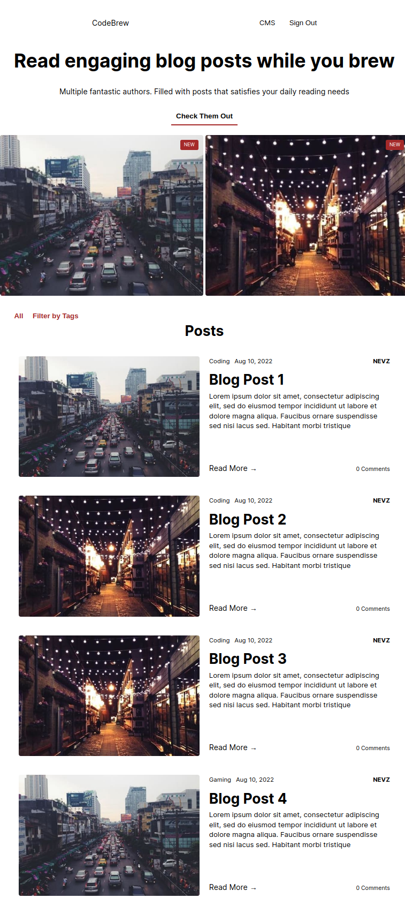
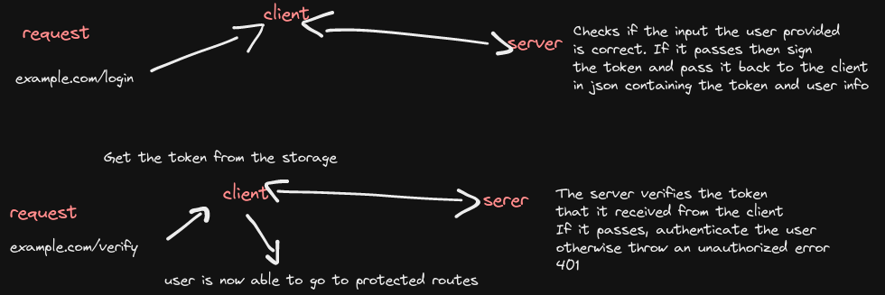

# blog-api

A Blogging Website Project made with React and Express

Check the client side: [Client](https://github.com/nevz9/blog-api/tree/main/client)

Check the server side: [Server](https://github.com/nevz9/blog-api/tree/main/server)

## Preview

## Demo
[Live Preview](https://nevz9.github.io/blog-api)

## Features

- Create, Update, and Delete Blog Posts
- Delete Comments (Author)
- Upload Image for Blog Post (Multer and Cloudinary)
- WYSIWYG Editor (TinyMCE)
- Add Comments to a Blog Post
- Filter by Tag
- Responsive Design

## Lessons Learned

Understood how authentication works, how the server communicates to the client

Authentication was done using Passport and JWT. Saving the token 
received from the server in a local storage in order for login state to persist in the client  

The project definitely solidified my understanding about JWT. 
Although Passport already does the work behind the scenes.
I still learned a lot reading through their docs and source code.

## Built With

## Acknowledgements
